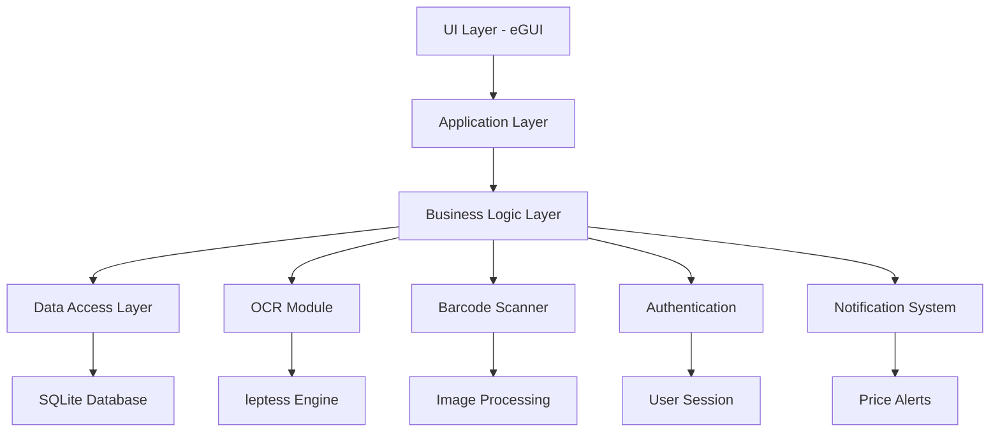
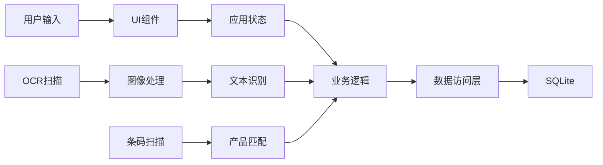
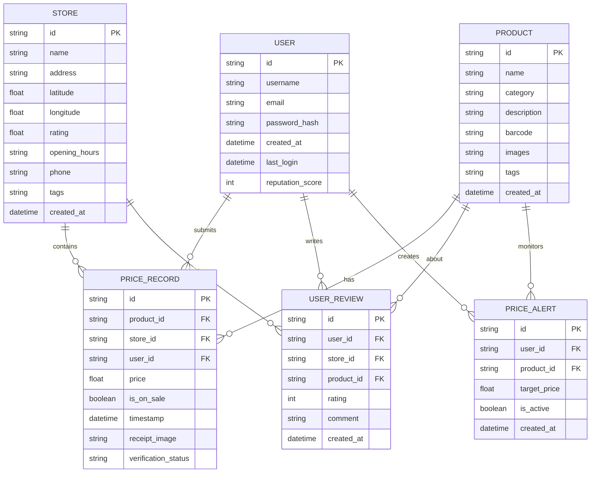
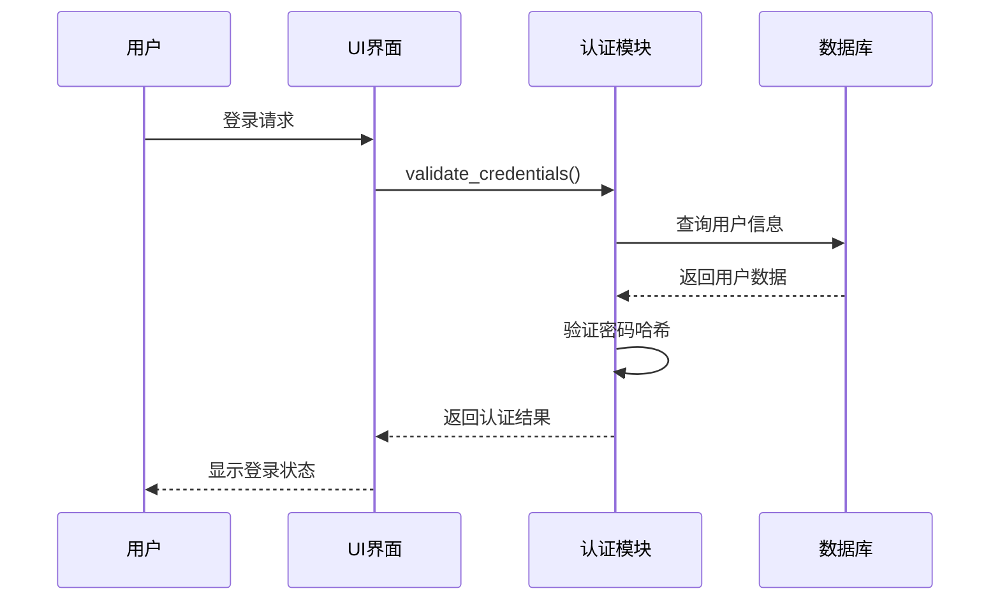
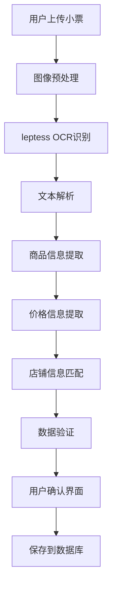
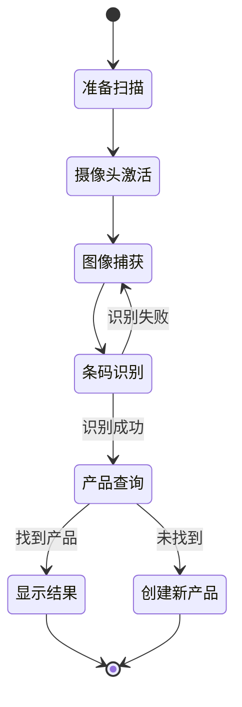
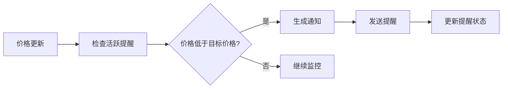
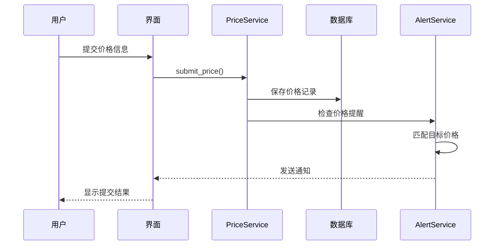
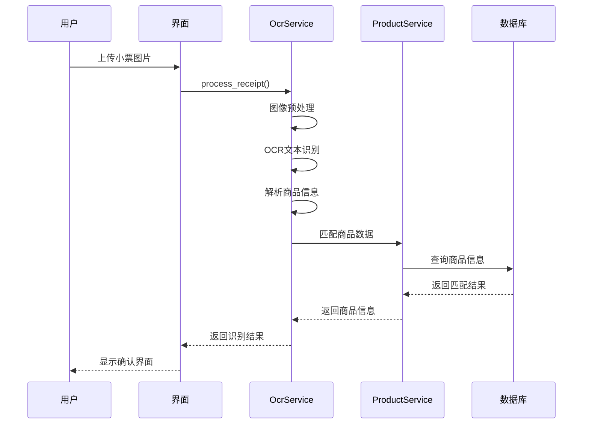

# eprice 本地比价应用 - 未实现功能设计文档

## 1. 概述

eprice 是一个基于 Rust 和 eGUI 的本地价格比较应用，旨在为日本线下实体店提供价格比较服务。当前项目已实现基础的门店展示和商品列表功能，但核心功能仍需开发。

### 技术栈
- **UI框架**: eGUI 0.31 + eframe 0.31
- **数据库**: SQLite + SQLx
- **OCR引擎**: leptess 0.35.0
- **地图服务**: OpenStreetMap (walkers)
- **状态管理**: Arc<Mutex<T>> / egui::Context
- **Web支持**: wasm-bindgen + WebAssembly

### 项目结构
```
src/
├── app.rs          # 主应用逻辑 (已实现基础UI)
├── models.rs       # 数据模型 (已实现Store, Product, PriceRecord)
├── main.rs         # 入口点
├── lib.rs          # 库模块
├── database/       # 数据库层 (待实现)
├── ocr/           # OCR识别模块 (待实现)
├── auth/          # 用户认证 (待实现)
├── scanner/       # 条码扫描 (待实现)
└── utils/         # 工具函数 (待实现)
```

## 2. 架构设计

### 2.1 整体架构



### 2.2 数据流架构



## 3. 核心功能实现设计

### 3.1 数据库系统

#### 3.1.1 数据库架构



#### 3.1.2 数据库组件设计

| 组件 | 功能 | 实现方式 |
|------|------|----------|
| DatabaseManager | 数据库连接管理 | SQLx连接池 |
| Migration | 数据库迁移 | SQL脚本 + 版本控制 |
| Repository | 数据访问层 | 泛型Repository模式 |
| Transaction | 事务管理 | SQLx事务API |

### 3.2 用户认证系统

#### 3.2.1 认证流程



#### 3.2.2 认证组件

| 组件 | 功能 | 实现细节 |
|------|------|----------|
| AuthManager | 认证管理器 | bcrypt密码哈希, JWT token |
| UserSession | 用户会话 | 内存存储 + 持久化 |
| PermissionManager | 权限管理 | 基于角色的权限控制 |
| SecurityMiddleware | 安全中间件 | 输入验证, 防止注入攻击 |

### 3.3 OCR识别系统

#### 3.3.1 OCR处理流程



#### 3.3.2 OCR组件设计

| 组件 | 功能 | 技术实现 |
|------|------|----------|
| ImageProcessor | 图像预处理 | 去噪, 二值化, 旋转校正 |
| TextExtractor | 文本识别 | leptess引擎集成 |
| ReceiptParser | 小票解析 | 正则表达式 + 模式匹配 |
| DataMatcher | 数据匹配 | 模糊匹配算法 |

### 3.4 条码扫描系统

#### 3.4.1 扫描处理流程



#### 3.4.2 扫描组件

| 组件 | 功能 | 实现方式 |
|------|------|----------|
| CameraManager | 摄像头控制 | WebRTC API (Web) / 系统API (Native) |
| BarcodeDecoder | 条码解码 | ZXing-rs 或类似库 |
| ProductMatcher | 产品匹配 | 数据库查询 + 外部API |
| ScanHistory | 扫描历史 | 本地存储 |

### 3.5 价格提醒系统

#### 3.5.1 提醒机制



#### 3.5.2 提醒组件

| 组件 | 功能 | 实现方式 |
|------|------|----------|
| AlertManager | 提醒管理 | 定时任务 + 事件驱动 |
| NotificationService | 通知服务 | 系统通知 + 应用内提醒 |
| PriceMonitor | 价格监控 | 后台服务 |
| AlertScheduler | 调度器 | 基于时间的触发器 |

## 4. 用户界面设计

### 4.1 新增界面组件

#### 4.1.1 用户认证界面

```
┌─────────────────────────────┐
│        登录 / 注册          │
├─────────────────────────────┤
│ 用户名: [____________]      │
│ 密码:   [____________]      │
│                             │
│ [登录] [注册] [忘记密码]    │
│                             │
│ □ 记住我                    │
└─────────────────────────────┘
```

#### 4.1.2 OCR扫描界面

```
┌─────────────────────────────┐
│        小票扫描             │
├─────────────────────────────┤
│ [📷 拍摄小票]              │
│ [📁 选择图片]              │
│                             │
│ 识别结果:                   │
│ ┌─────────────────────────┐ │
│ │ 商品1: ¥123.45          │ │
│ │ 商品2: ¥67.89           │ │
│ │ 店铺: 全家便利店         │ │
│ └─────────────────────────┘ │
│                             │
│ [确认] [重新识别] [取消]    │
└─────────────────────────────┘
```

#### 4.1.3 条码扫描界面

```
┌─────────────────────────────┐
│        条码扫描             │
├─────────────────────────────┤
│ ┌─────────────────────────┐ │
│ │     摄像头预览区域      │ │
│ │                         │ │
│ │    [扫描框指示器]       │ │
│ │                         │ │
│ └─────────────────────────┘ │
│                             │
│ 扫描提示: 将条码对准框内    │
│                             │
│ [开始扫描] [停止] [手动输入] │
└─────────────────────────────┘
```

#### 4.1.4 价格提醒界面

```
┌─────────────────────────────┐
│        价格提醒             │
├─────────────────────────────┤
│ 商品: [可口可乐 330ml]      │
│ 目标价格: [¥3.00]          │
│ 当前最低价: ¥3.50          │
│                             │
│ 提醒方式:                   │
│ ☑ 应用内通知               │
│ ☐ 系统推送                 │
│                             │
│ [创建提醒] [取消]          │
│                             │
│ 我的提醒列表:               │
│ ┌─────────────────────────┐ │
│ │ 可口可乐 - ¥3.00 [删除] │ │
│ │ 百事可乐 - ¥2.80 [删除] │ │
│ └─────────────────────────┘ │
└─────────────────────────────┘
```

### 4.2 界面状态管理

| 状态 | 描述 | 管理方式 |
|------|------|----------|
| AuthState | 用户认证状态 | Arc<Mutex<Option<User>>> |
| ScanState | 扫描状态 | 状态机模式 |
| NotificationState | 通知状态 | 事件队列 |
| CacheState | 缓存状态 | LRU缓存 |

## 5. 数据模型扩展

### 5.1 新增数据模型

```rust
// 用户模型
pub struct User {
    pub id: String,
    pub username: String,
    pub email: String,
    pub password_hash: String,
    pub created_at: DateTime<Utc>,
    pub last_login: Option<DateTime<Utc>>,
    pub reputation_score: i32,
}

// 用户评价模型
pub struct UserReview {
    pub id: String,
    pub user_id: String,
    pub store_id: Option<String>,
    pub product_id: Option<String>,
    pub rating: i32,
    pub comment: String,
    pub created_at: DateTime<Utc>,
}

// 价格提醒模型
pub struct PriceAlert {
    pub id: String,
    pub user_id: String,
    pub product_id: String,
    pub target_price: f64,
    pub is_active: bool,
    pub created_at: DateTime<Utc>,
}

// OCR识别结果模型
pub struct OcrResult {
    pub id: String,
    pub image_path: String,
    pub extracted_text: String,
    pub parsed_items: Vec<ReceiptItem>,
    pub confidence_score: f32,
    pub created_at: DateTime<Utc>,
}

// 小票项目模型
pub struct ReceiptItem {
    pub name: String,
    pub price: f64,
    pub quantity: i32,
    pub category: Option<String>,
}
```

### 5.2 模型关系

```mermaid
classDiagram
    class User {
        +String id
        +String username
        +String email
        +DateTime created_at
        +i32 reputation_score
    }
    
    class Product {
        +String id
        +String name
        +String category
        +String barcode
        +Vec~String~ images
    }
    
    class Store {
        +String id
        +String name
        +String address
        +f64 latitude
        +f64 longitude
    }
    
    class PriceRecord {
        +String id
        +String product_id
        +String store_id
        +String user_id
        +f64 price
        +DateTime timestamp
    }
    
    class PriceAlert {
        +String id
        +String user_id
        +String product_id
        +f64 target_price
        +bool is_active
    }
    
    User ||--o{ PriceRecord : submits
    User ||--o{ PriceAlert : creates
    Product ||--o{ PriceRecord : has
    Store ||--o{ PriceRecord : contains
    Product ||--o{ PriceAlert : monitors
```

## 6. 业务逻辑层

### 6.1 核心服务

| 服务 | 职责 | 主要方法 |
|------|------|----------|
| UserService | 用户管理 | register(), login(), update_profile() |
| ProductService | 商品管理 | search(), create(), update_price() |
| StoreService | 店铺管理 | find_nearby(), get_details(), rate() |
| PriceService | 价格管理 | compare(), track_history(), alert() |
| OcrService | OCR处理 | process_receipt(), extract_data() |
| ScanService | 扫描服务 | scan_barcode(), lookup_product() |

### 6.2 业务流程

#### 6.2.1 用户提交价格流程



#### 6.2.2 OCR识别流程



## 7. 测试策略

### 7.1 测试层次

| 测试类型 | 范围 | 工具 |
|----------|------|------|
| 单元测试 | 个别函数/模块 | Rust内置测试框架 |
| 集成测试 | 模块间交互 | 测试数据库 + Mock |
| 功能测试 | 完整用户流程 | 自动化脚本 |
| 性能测试 | 响应时间/吞吐量 | Criterion.rs |

### 7.2 测试用例

#### 7.2.1 OCR测试用例

| 测试场景 | 输入 | 期望输出 |
|----------|------|----------|
| 清晰小票 | 高质量小票图片 | 准确识别商品和价格 |
| 模糊小票 | 低质量图片 | 部分识别 + 用户确认 |
| 倾斜小票 | 旋转图片 | 自动校正 + 识别 |
| 多语言小票 | 中日英混合 | 正确识别各语言文字 |

#### 7.2.2 价格提醒测试用例

| 测试场景 | 条件 | 期望行为 |
|----------|------|----------|
| 价格低于目标 | 新价格 < 目标价格 | 发送通知 |
| 价格高于目标 | 新价格 > 目标价格 | 不发送通知 |
| 提醒已停用 | 用户停用提醒 | 不发送通知 |
| 重复价格 | 相同价格多次更新 | 只发送一次通知 |

### 7.3 数据测试

#### 7.3.1 数据库测试

```rust
#[cfg(test)]
mod database_tests {
    use super::*;
    
    #[tokio::test]
    async fn test_user_crud_operations() {
        let db = setup_test_database().await;
        let user_service = UserService::new(db);
        
        // 测试用户创建
        let user = user_service.create_user("test", "test@example.com", "password").await;
        assert!(user.is_ok());
        
        // 测试用户查询
        let found_user = user_service.find_by_email("test@example.com").await;
        assert!(found_user.is_ok());
        
        // 测试用户更新
        // ...
    }
}
```

## 8. 部署配置

### 8.1 构建配置

#### 8.1.1 原生应用构建

```bash
# 开发环境
cargo build

# 生产环境
cargo build --release

# 带OCR支持的构建
cargo build --release --features "ocr"
```

#### 8.1.2 WebAssembly构建

```bash
# 安装WASM目标
rustup target add wasm32-unknown-unknown

# 构建WASM版本
trunk build --release
```

### 8.2 运行时配置

#### 8.2.3 环境变量

| 变量名 | 描述 | 默认值 |
|--------|------|--------|
| DATABASE_URL | 数据库连接字符串 | sqlite:./eprice.db |
| OCR_MODEL_PATH | OCR模型路径 | ./models/ocr |
| MAX_UPLOAD_SIZE | 最大上传文件大小 | 10MB |
| CACHE_SIZE | 缓存大小 | 100MB |

#### 8.2.4 配置文件

```toml
# config.toml
[database]
url = "sqlite:./eprice.db"
max_connections = 10

[ocr]
model_path = "./models/ocr"
confidence_threshold = 0.8

[notification]
enable_system_notifications = true
enable_sound = true

[cache]
max_size_mb = 100
ttl_hours = 24
```

## 9. 性能优化

### 9.1 数据库优化

| 优化方案 | 实现方式 | 预期收益 |
|----------|----------|----------|
| 索引优化 | 为查询字段添加索引 | 查询速度提升50% |
| 连接池 | SQLx连接池管理 | 减少连接开销 |
| 查询优化 | 批量操作 + 分页 | 减少内存使用 |
| 缓存策略 | LRU缓存热点数据 | 减少数据库访问 |

### 9.2 UI性能优化

| 优化方案 | 实现方式 | 预期收益 |
|----------|----------|----------|
| 虚拟滚动 | 大列表分批渲染 | 减少内存占用 |
| 图片懒加载 | 按需加载商品图片 | 提升加载速度 |
| 状态管理 | 细粒度状态更新 | 减少重绘次数 |
| 异步处理 | 耗时操作后台执行 | 提升响应性 |

### 9.3 OCR性能优化

| 优化方案 | 实现方式 | 预期收益 |
|----------|----------|----------|
| 图像预处理 | 多线程处理 | 处理速度提升30% |
| 模型优化 | 使用轻量级模型 | 减少内存占用 |
| 批量处理 | 多图片并行识别 | 提升吞吐量 |
| 结果缓存 | 缓存识别结果 | 避免重复处理 |

## 10. 安全考虑

### 10.1 数据安全

| 安全措施 | 实现方式 | 保护内容 |
|----------|----------|----------|
| 密码加密 | bcrypt哈希 | 用户密码 |
| 数据加密 | SQLite加密 | 敏感数据 |
| 输入验证 | 参数校验 | SQL注入防护 |
| 访问控制 | 权限管理 | 数据访问权限 |

### 10.2 隐私保护

| 保护措施 | 实现方式 | 保护内容 |
|----------|----------|----------|
| 数据最小化 | 仅收集必要数据 | 用户隐私 |
| 本地存储 | 数据不上传云端 | 个人信息 |
| 匿名化 | 用户ID匿名处理 | 行为数据 |
| 删除权限 | 用户可删除数据 | 个人数据控制 |