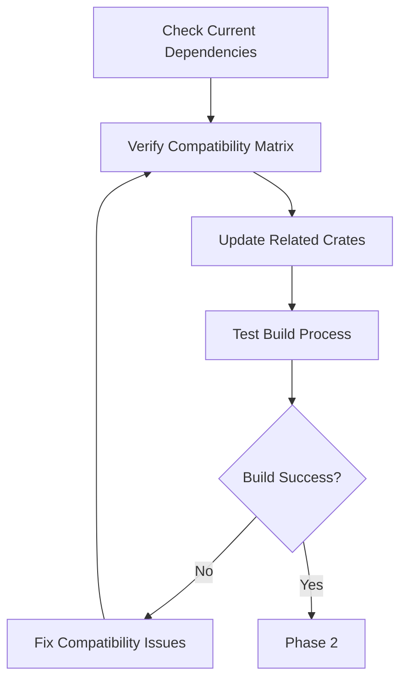
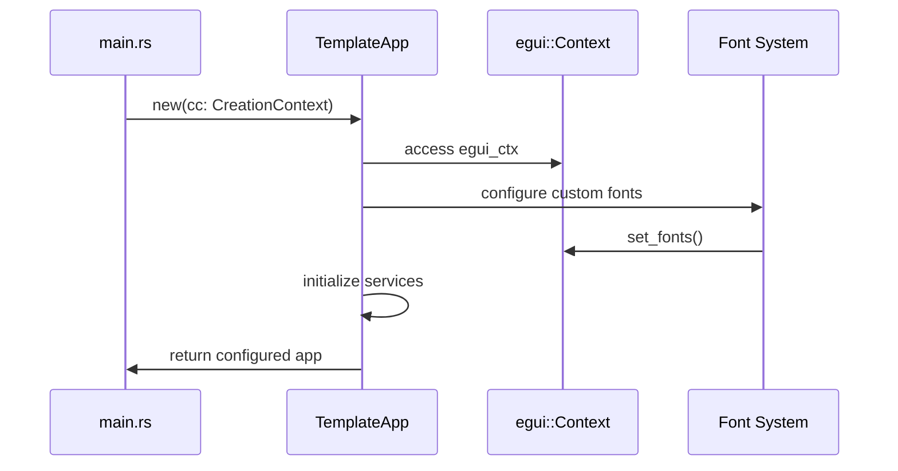

# Upgrade egui to Version 0.32.3

## Overview

This document outlines the design for upgrading the eprice application's egui framework from version 0.31 to 0.32.3. The upgrade aims to leverage the latest features, performance improvements, and bug fixes in the egui ecosystem while ensuring compatibility with the existing codebase.

## Current State Analysis

### Current Dependencies
- **egui**: Already at 0.32.3
- **eframe**: Already at 0.32.3  
- **egui_extras**: Already at 0.32.3
- **walkers**: 0.45.0 (map integration)

### Architecture Components
The application uses a modular structure with the following egui-dependent components:
- Main application loop (`TemplateApp`)
- Authentication UI components
- Scanner UI (native only)
- Map integration via walkers
- Tab-based navigation system
- Service layer integration

## Upgrade Strategy

### Phase 1: Dependency Verification
Ensure all egui-related dependencies are compatible with version 0.32.3:



### Phase 2: API Migration Analysis

#### Core Framework Changes
Analysis of potential breaking changes between 0.31 and 0.32.3:

| Component | Current Implementation | Potential Changes | Risk Level |
|-----------|----------------------|-------------------|------------|
| `eframe::App` trait | Standard implementation | API stability expected | Low |
| ViewportBuilder | Current usage in main.rs | Minor API changes possible | Low |
| Font configuration | Custom font loading | Font API changes | Medium |
| Panel layouts | TopBottomPanel, SidePanel | Layout API refinements | Low |
| Map integration | Walkers compatibility | Third-party dependency | Medium |

#### Critical Integration Points
1. **Font System**: Custom Chinese font integration via `egui::FontDefinitions`
2. **State Persistence**: Serde integration for app state
3. **Platform Targets**: Native and WASM compilation
4. **Map Rendering**: Walkers crate integration with egui context

### Phase 3: Code Adaptation

#### Application Initialization
Review and update the application initialization sequence:



#### UI Component Updates
Systematic review of UI components for API changes:

1. **Panel Systems**
   - TopBottomPanel configuration
   - SidePanel layout
   - CentralPanel rendering

2. **Widget Integration**
   - Button and input widgets
   - Table components (egui_extras)
   - Custom widget implementations

3. **Event Handling**
   - Input event processing
   - Context menu systems
   - Keyboard shortcuts

### Phase 4: Platform-Specific Considerations

#### Native Platform (Desktop)
- Window management and viewport configuration
- File dialog integration (rfd crate)
- Native font loading

#### Web Platform (WASM)
- WebRunner initialization
- Canvas element management
- Web-specific logging (WebLogger)
- Asset loading optimization

### Phase 5: Testing Strategy

#### Compatibility Testing Matrix

| Test Category | Native (Windows) | Native (Linux) | Native (macOS) | Web (Chrome) | Web (Firefox) | Web (Safari) |
|---------------|------------------|----------------|----------------|--------------|---------------|--------------|
| Basic UI Rendering | ✓ | ✓ | ✓ | ✓ | ✓ | ✓ |
| Font Display | ✓ | ✓ | ✓ | ✓ | ✓ | ✓ |
| Map Integration | ✓ | ✓ | ✓ | ✓ | ✓ | ✓ |
| State Persistence | ✓ | ✓ | ✓ | ✓ | ✓ | ✓ |
| Scanner (Native) | ✓ | ✓ | ✓ | N/A | N/A | N/A |

#### Performance Validation
1. **Startup Time**: Measure application initialization
2. **Frame Rate**: UI responsiveness under load
3. **Memory Usage**: Heap allocation patterns
4. **Bundle Size**: WASM output optimization

## Implementation Roadmap

### Step 1: Environment Preparation
1. Update Rust toolchain to 1.86
2. Verify cargo and trunk versions
3. Clean build environment

### Step 2: Dependency Updates
1. Confirm egui ecosystem versions in Cargo.toml
2. Update related dependencies if needed
3. Check for deprecated features

### Step 3: Code Migration
1. Review font configuration implementation
2. Test state serialization compatibility
3. Validate map integration
4. Update conditional compilation flags

### Step 4: Build Verification
1. Native build testing
   ```bash
   cargo build --release
   cargo run
   ```

2. Web build testing
   ```bash
   trunk build --release
   trunk serve
   ```

### Step 5: Functional Testing
1. UI navigation testing
2. Store management functionality
3. Product comparison features
4. Map visualization
5. State persistence validation

## Risk Mitigation

### Compatibility Risks
- **Font Loading**: Custom font configuration may require API updates
- **Map Integration**: Walkers crate compatibility with new egui version
- **State Serialization**: Potential serde trait changes

### Mitigation Strategies
1. **Incremental Testing**: Test each component separately
2. **Rollback Plan**: Maintain version control checkpoints
3. **Documentation**: Update inline documentation for API changes
4. **Community Support**: Leverage egui community resources

## Success Criteria

### Functional Requirements
- All existing features work without regression
- UI rendering consistency across platforms
- State persistence maintains data integrity
- Map integration functions correctly

### Non-Functional Requirements
- Build process completes without errors
- Performance metrics meet or exceed current benchmarks
- Bundle size remains within acceptable limits
- Cross-platform compatibility maintained

## Post-Upgrade Validation

### Verification Checklist
- [ ] Application starts successfully on all platforms
- [ ] All tabs render correctly
- [ ] Store management functions work
- [ ] Product comparison displays properly
- [ ] Map integration shows stores correctly
- [ ] Font rendering displays Chinese characters
- [ ] State saves and restores between sessions
- [ ] Scanner functionality works (native only)
- [ ] Authentication flows complete successfully

### Performance Monitoring
1. Baseline measurements before upgrade
2. Post-upgrade performance comparison
3. Memory usage analysis
4. Frame rate consistency check

## Future Considerations

### Ecosystem Evolution
- Monitor egui roadmap for future updates
- Plan for regular maintenance updates
- Consider new features in upcoming versions

### Technical Debt
- Review deprecated API usage
- Update build configurations
- Optimize dependency tree