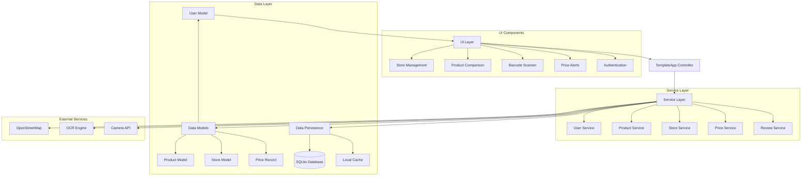

# eprice - Local Price Comparison Application

<div align="center">

[](https://www.rust-lang.org)
[](https://github.com/emilk/egui)
[](#license)

A modern cross-platform price comparison application for offline retail stores in Japan.

[Features](#features) • [Quick Start](#quick-start) • [Architecture](#architecture) • [Development](#development) • [Contributing](#contributing)

</div>

## Overview

eprice is a community-driven price comparison application designed specifically for offline retail stores in Japan. It empowers users to quickly compare product prices across different physical stores, with innovative features like OCR-powered receipt scanning for automatic price data entry.

### Key Value Propositions

- **💰 Cost Savings**: Find the lowest prices for products across nearby stores
- **⏱️ Time Efficiency**: Eliminate the need for physical store visits to compare prices
- **📊 Informed Decisions**: Access historical price trends to determine optimal buying times
- **📱 Convenience**: Use barcode/QR code scanning for instant product lookup
- **🤝 Community-Driven**: Contribute to and benefit from shared pricing data
- **🔌 Offline Support**: View cached price data without constant internet connectivity

## Features

### 🏪 Store Management
- **Interactive Map Display**: Visualize nearby stores with OpenStreetMap integration
- **Advanced Search & Filtering**: Find stores by name, category, or proximity
- **Detailed Store Information**: Access addresses, operating hours, contact details, and ratings
- **Location-Based Services**: Automatic detection of nearby stores based on current location

### 🛒 Product Price Comparison
- **Comprehensive Search**: Find products with fuzzy matching and category filtering
- **Cross-Store Price Analysis**: Compare prices across multiple retailers instantly
- **Real-Time Updates**: Community-driven pricing data with user verification
- **Product Details**: View comprehensive product information with images and specifications

### 📈 Price Trend Analysis
- **Historical Price Tracking**: Monitor price changes over time across different stores
- **Trend Visualization**: Interactive charts showing price fluctuations and patterns
- **Purchase Timing Insights**: Data-driven recommendations for optimal buying opportunities
- **Market Analysis**: Understand regional pricing patterns and competition

### 👥 Community Features
- **Collaborative Price Updates**: Users can submit and verify pricing information
- **Review System**: Rate and review stores and products
- **Reputation Management**: User scoring system for trusted contributors
- **Moderation Tools**: Community-driven content validation with like/report mechanisms

### 🔍 Smart Search & Scanning
- **Barcode/QR Code Support**: Instant product lookup through camera scanning
- **Intelligent Search**: Advanced keyword matching with category suggestions
- **Voice Search**: Hands-free product discovery (planned)
- **Image Recognition**: Product identification through photos (planned)

### 📄 Receipt Scanning (OCR)
- **Automated Data Extraction**: Camera-based receipt scanning with OCR processing
- **Smart Product Matching**: Automatic correlation with existing product database
- **Price Update Automation**: Seamless integration of scanned data into price records
- **Manual Correction Interface**: User-friendly editing tools for OCR accuracy improvement
- **Gamification**: Optional reward system for community data contributions

### 🌐 Localization & Accessibility
- **Offline-First Design**: Core functionality available without internet connection
- **Multi-Currency Support**: Automatic currency conversion and regional pricing
- **Japanese Market Focus**: Optimized for Japanese retail ecosystem and user preferences
- **Cross-Platform Compatibility**: Native desktop and web browser support

## Quick Start

### Prerequisites

- **Rust**: Version 1.86 or higher
- **Git**: For cloning the repository
- **Trunk**: For WebAssembly builds (web deployment)

### Installation

1. **Clone the repository**
   ```bash
   git clone https://github.com/your-username/eprice.git
   cd eprice
   ```

2. **Set up the Rust environment**
   ```bash
   rustup override set 1.86
   rustup target add wasm32-unknown-unknown  # For web builds
   ```

3. **Install Trunk** (for web builds)
   ```bash
   cargo install trunk
   ```

### Running the Application

#### Native Desktop Application
```bash
# Development build
cargo run

# Release build
cargo run --release
```

#### Web Application
```bash
# Development server
trunk serve

# Production build
trunk build --release
```

The web application will be available at `http://localhost:8080`.

### Building for Distribution

#### Desktop Binary
```bash
cargo build --release
```
The binary will be located at `target/release/eprice[.exe]`.

#### Web Bundle
```bash
trunk build --release
```
Static files will be generated in the `dist/` directory.

## Technology Stack

### Core Framework
- **GUI Framework**: [egui](https://github.com/emilk/egui) 0.32.3 + [eframe](https://github.com/emilk/egui/tree/master/crates/eframe) 0.32.3
- **Cross-Platform**: Native (Windows, macOS, Linux) and WebAssembly support
- **Build Tool**: [Trunk](https://trunkrs.dev/) for WASM compilation
- **Language**: Rust 2024 Edition

### Key Dependencies
```toml
egui = "0.32.3"
eframe = { version = "0.32.3", features = ["glow", "persistence", "wayland", "accesskit", "default_fonts"] }
serde = { version = "1", features = ["derive"] }
serde_json = "1.0"
walkers = "0.45.0"  # OpenStreetMap integration
geo = { version = "0.31.0", features = ["use-serde"] }
chrono = { version = "0.4.40", features = ["serde"] }
egui_extras = "0.32.3"
uuid = { version = "1.0", features = ["v4", "serde", "js"] }
```

### Planned Dependencies (Currently Disabled)
```toml
# Database layer
sqlx = { version = "0.7", features = ["runtime-tokio-rustls", "sqlite", "chrono", "uuid"] }
tokio = { version = "1.0", features = ["full"] }

# OCR functionality
leptess = "0.14"
image = { version = "0.25", features = ["jpeg", "png"] }

# Camera access
nokhwa = "0.10"

# Authentication
bcrypt = "0.15"
```

### Platform-Specific Dependencies
- **Native**: `env_logger`, `rfd` (file dialogs)
- **Web**: `wasm-bindgen-futures`, `web-sys`

## Architecture

### System Overview

eprice follows a modular architecture with clear separation of concerns, built on the Model-View-Controller (MVC) pattern:



### Module Structure

```
src/
├── app.rs              # Main application controller
├── main.rs             # Entry point
├── lib.rs              # Library root
├── models.rs           # Core data models
├── auth/               # Authentication system
│   ├── mod.rs          # Auth module root
│   ├── models.rs       # User/session models
│   ├── auth_manager.rs # Authentication logic
│   ├── session.rs      # Session management
│   └── ui.rs           # Auth UI components
├── database/           # Data persistence layer
│   ├── mod.rs          # Database module root
│   ├── connection.rs   # Database connections
│   ├── migrations.rs   # Schema migrations
│   └── repository.rs   # Data access layer
├── services/           # Business logic layer
│   ├── mod.rs          # Services module root
│   ├── user_service.rs # User management
│   ├── product_service.rs # Product operations
│   ├── store_service.rs # Store management
│   ├── price_service.rs # Price tracking
│   └── review_service.rs # Review system
├── scanner/            # Barcode/QR scanning
│   ├── mod.rs          # Scanner module root
│   ├── models.rs       # Scanner data models
│   ├── barcode_decoder.rs # Barcode processing
│   ├── camera_manager.rs # Camera interface
│   ├── product_matcher.rs # Product matching
│   └── ui.rs           # Scanner UI
├── ocr/                # OCR processing
│   ├── mod.rs          # OCR module root
│   ├── models.rs       # OCR data models
│   ├── text_extractor.rs # Text extraction
│   ├── image_processor.rs # Image preprocessing
│   └── receipt_parser.rs # Receipt parsing
├── alerts/             # Price monitoring
│   ├── mod.rs          # Alerts module root
│   ├── monitor.rs      # Price monitoring
│   └── notification.rs # Notification delivery
└── utils/              # Utility functions
    ├── mod.rs          # Utils module root
    ├── crypto.rs       # Cryptographic functions
    ├── file_utils.rs   # File operations
    ├── notification.rs # System notifications
    └── validation.rs   # Input validation
```

### State Management

The application uses a centralized state management approach:

- **`TemplateApp`**: Central application state container
- **Service Layer**: Business logic and data operations
- **Serde Integration**: Persistent state serialization
- **Arc<Mutex<T>>**: Thread-safe shared state for concurrent operations
- **egui::Context**: UI state and rendering context

### Cross-Platform Support

- **Native**: Desktop applications for Windows, macOS, and Linux
- **Web**: WebAssembly compilation for browser deployment
- **Conditional Compilation**: Platform-specific features using `#[cfg()]` attributes
- **Progressive Web App**: Service worker support for offline functionality

## Development

### Project Structure

The project follows Rust conventions with a modular architecture:

- **Separation of Concerns**: Clear boundaries between UI, business logic, and data layers
- **Service Pattern**: Business logic encapsulated in service structs
- **Repository Pattern**: Data access abstraction for future database integration
- **Error Handling**: Consistent error types with `ServiceError` enum
- **Testing**: Comprehensive unit and integration tests

### Coding Standards

- **Rust Edition**: 2024
- **Formatting**: `cargo fmt` with default settings
- **Linting**: `cargo clippy` with strict warnings
- **Documentation**: Comprehensive rustdoc comments for public APIs
- **Testing**: Minimum 80% code coverage target

### Development Workflow

1. **Setup Development Environment**
   ```bash
   git clone https://github.com/your-username/eprice.git
   cd eprice
   rustup override set 1.86
   ```

2. **Run Tests**
   ```bash
   cargo test
   cargo test --release
   ```

3. **Code Quality Checks**
   ```bash
   cargo fmt --all
   cargo clippy --all-targets --all-features
   cargo doc --no-deps --open
   ```

4. **Platform Testing**
   ```bash
   # Native build
   cargo run
   
   # Web build
   trunk serve
   ```

### Testing

#### Running Tests
```bash
# Run all tests
cargo test

# Run tests with output
cargo test -- --nocapture

# Run specific test module
cargo test integration_tests

# Run tests in release mode
cargo test --release
```

#### Test Coverage
```bash
# Install cargo-tarpaulin for coverage reports
cargo install cargo-tarpaulin

# Generate coverage report
cargo tarpaulin --out Html
```

#### Test Structure
- **Unit Tests**: Located alongside source code in individual modules
- **Integration Tests**: Located in `tests/` directory
- **Mock Services**: Using `mockall` crate for service mocking
- **Test Data**: Sample data generators in test utilities

### Contributing Guidelines

1. **Fork and Branch**
   ```bash
   git checkout -b feature/your-feature-name
   ```

2. **Follow Code Standards**
   - Run `cargo fmt` before committing
   - Ensure `cargo clippy` passes without warnings
   - Add tests for new functionality
   - Update documentation as needed

3. **Commit Message Format**
   ```
   type(scope): brief description
   
   Detailed explanation of changes (if needed)
   
   Closes #issue-number
   ```

4. **Pull Request Process**
   - Ensure all tests pass
   - Add appropriate labels
   - Request review from maintainers
   - Address feedback promptly

## API Reference

### Core Data Models

#### Product Model
```rust
pub struct Product {
    pub id: String,
    pub name: String,
    pub category: String,
    pub description: String,
    pub barcode: Option<String>,
    pub images: Vec<String>,
    pub prices: Vec<PriceRecord>,
    pub tags: Vec<String>,
    pub created_at: DateTime<Utc>,
}

impl Product {
    pub fn new(name: String, category: String, description: String, 
               barcode: Option<String>, images: Vec<String>, 
               tags: Vec<String>) -> Self;
    pub fn current_lowest_price(&self) -> Option<&PriceRecord>;
    pub fn price_at_store(&self, store_id: &str) -> Option<&PriceRecord>;
    pub fn add_price_record(&mut self, price_record: PriceRecord);
}
```

#### Store Model
```rust
pub struct Store {
    pub id: String,
    pub name: String,
    pub address: String,
    pub latitude: f64,
    pub longitude: f64,
    pub rating: f64,
    pub opening_hours: String,
    pub phone: String,
    pub tags: Vec<String>,
    pub symbol: char,
    pub created_at: DateTime<Utc>,
}

impl Store {
    pub fn new(name: String, address: String, latitude: f64, 
               longitude: f64, opening_hours: String, 
               phone: String, tags: Vec<String>) -> Self;
    pub fn distance_to(&self, lat: f64, lon: f64) -> f64;
    pub fn is_open_now(&self) -> bool; // Planned
}
```

#### PriceRecord Model
```rust
pub struct PriceRecord {
    pub id: Option<String>,
    pub product_id: Option<String>,
    pub store_id: String,
    pub user_id: Option<String>,
    pub price: f64,
    pub timestamp: DateTime<Utc>,
    pub is_on_sale: bool,
    pub receipt_image: Option<String>,
    pub verification_status: String,
}

impl PriceRecord {
    pub fn new(store_id: String, price: f64) -> Self;
    pub fn with_user(store_id: String, user_id: String, price: f64) -> Self;
    pub fn mark_verified(&mut self);
    pub fn is_recent(&self, hours: i64) -> bool;
}
```

#### User Model
```rust
pub struct User {
    pub id: String,
    pub username: String,
    pub email: String,
    pub password_hash: String,
    pub created_at: DateTime<Utc>,
    pub last_login: Option<DateTime<Utc>>,
    pub reputation_score: i32,
}

impl User {
    pub fn new(username: String, email: String, password_hash: String) -> Self;
    pub fn update_last_login(&mut self);
    pub fn can_moderate(&self) -> bool; // reputation_score >= threshold
}
```

### Service Layer APIs

#### ProductService
```rust
pub struct ProductService {
    // Implementation details
}

impl ProductService {
    pub fn new() -> Self;
    pub fn get_all_products(&self) -> Result<Vec<Product>, ServiceError>;
    pub fn get_product_by_id(&self, id: &str) -> Result<Option<Product>, ServiceError>;
    pub fn search_products(&self, query: &str, category: Option<&str>) -> Result<Vec<Product>, ServiceError>;
    pub fn create_product(&mut self, product: Product) -> Result<(), ServiceError>;
    pub fn update_product(&mut self, product: Product) -> Result<(), ServiceError>;
    pub fn get_products_by_category(&self, category: &str) -> Result<Vec<Product>, ServiceError>;
    pub fn get_lowest_prices(&self) -> Result<Vec<(Product, PriceRecord)>, ServiceError>;
}
```

#### StoreService
```rust
pub struct StoreService {
    // Implementation details
}

impl StoreService {
    pub fn new() -> Self;
    pub fn get_all_stores(&self) -> Result<Vec<Store>, ServiceError>;
    pub fn get_store_by_id(&self, id: &str) -> Result<Option<Store>, ServiceError>;
    pub fn search_stores(&self, query: &str) -> Result<Vec<Store>, ServiceError>;
    pub fn get_nearby_stores(&self, lat: f64, lon: f64, radius_km: f64) -> Result<Vec<Store>, ServiceError>;
    pub fn create_store(&mut self, store: Store) -> Result<(), ServiceError>;
    pub fn update_store(&mut self, store: Store) -> Result<(), ServiceError>;
    pub fn get_stores_by_tag(&self, tag: &str) -> Result<Vec<Store>, ServiceError>;
}
```

#### PriceService
```rust
pub struct PriceService {
    // Implementation details
}

impl PriceService {
    pub fn new() -> Self;
    pub fn get_price_history(&self, product_id: &str, store_id: &str) -> Result<Vec<PriceRecord>, ServiceError>;
    pub fn get_current_prices(&self, product_id: &str) -> Result<Vec<PriceRecord>, ServiceError>;
    pub fn add_price_record(&mut self, price_record: PriceRecord) -> Result<(), ServiceError>;
    pub fn get_lowest_price(&self, product_id: &str) -> Result<Option<PriceRecord>, ServiceError>;
    pub fn get_price_trends(&self, product_id: &str, days: i32) -> Result<Vec<(DateTime<Utc>, f64)>, ServiceError>;
    pub fn compare_prices(&self, product_id: &str) -> Result<Vec<(Store, PriceRecord)>, ServiceError>;
}
```

#### UserService
```rust
pub struct UserService {
    // Implementation details
}

impl UserService {
    pub fn new() -> Self;
    pub fn register_user(&mut self, username: String, email: String, password: String) -> Result<User, ServiceError>;
    pub fn authenticate_user(&self, username: &str, password: &str) -> Result<Option<User>, ServiceError>;
    pub fn get_user_by_id(&self, id: &str) -> Result<Option<User>, ServiceError>;
    pub fn update_user(&mut self, user: User) -> Result<(), ServiceError>;
    pub fn update_reputation(&mut self, user_id: &str, delta: i32) -> Result<(), ServiceError>;
    pub fn get_user_contributions(&self, user_id: &str) -> Result<Vec<PriceRecord>, ServiceError>;
}
```

### Error Handling

```rust
#[derive(Debug, thiserror::Error)]
pub enum ServiceError {
    #[error("Not found: {0}")]
    NotFound(String),
    
    #[error("Validation error: {0}")]
    ValidationError(String),
    
    #[error("Authentication failed")]
    AuthenticationError,
    
    #[error("Database error: {0}")]
    DatabaseError(String),
    
    #[error("Internal server error: {0}")]
    InternalError(String),
}
```

## Feature Implementation Details

### Store Management System

#### Map Integration
- **Library**: `walkers` crate for OpenStreetMap integration
- **Tiles**: HTTP-based tile loading with caching
- **Interaction**: Click-to-select, zoom, pan functionality
- **Symbols**: Custom store icons based on category

```rust
// Example: Adding a store to the map
let position = Position::from_lat_lon(store.latitude, store.longitude);
let symbol = Symbol::from_char(store.symbol).with_scale(1.5);
let labeled_symbol = LabeledSymbol::new(symbol, store.name.clone())
    .with_style(LabeledSymbolStyle::default());
```

#### Search and Filtering
- **Text Search**: Fuzzy matching on store names and addresses
- **Category Filtering**: Filter by store type (convenience, pharmacy, etc.)
- **Distance Filtering**: Radius-based filtering from current location
- **Tag-based Search**: Multiple tag support for refined results

### Price Comparison Engine

#### Price Data Structure
```rust
// Price comparison results
pub struct PriceComparison {
    pub product: Product,
    pub prices: Vec<StorePrice>,
    pub lowest_price: Option<StorePrice>,
    pub average_price: f64,
    pub price_range: (f64, f64),
}

pub struct StorePrice {
    pub store: Store,
    pub price_record: PriceRecord,
    pub distance_km: f64,
}
```

#### Trend Analysis
- **Time Series Data**: Price history tracking with timestamps
- **Moving Averages**: 7-day, 30-day trend calculations
- **Seasonal Patterns**: Holiday and seasonal price analysis
- **Prediction Models**: Basic price forecasting (planned)

### OCR Integration (Planned)

#### Receipt Processing Pipeline
1. **Image Preprocessing**: Contrast enhancement, noise reduction
2. **Text Extraction**: leptess OCR engine integration
3. **Data Parsing**: Regular expressions for price/item extraction
4. **Product Matching**: Fuzzy string matching against product database
5. **Validation**: User confirmation and correction interface

```rust
// Example OCR workflow
pub struct ReceiptProcessor {
    ocr_engine: LeptessEngine,
    product_matcher: ProductMatcher,
}

impl ReceiptProcessor {
    pub fn process_receipt(&self, image_path: &str) -> Result<OcrResult, OcrError> {
        let text = self.ocr_engine.extract_text(image_path)?;
        let items = self.parse_receipt_items(&text)?;
        let matched_products = self.product_matcher.match_items(items)?;
        Ok(OcrResult::new(image_path.to_string(), text, matched_products, 0.85))
    }
}
```

### Alert System Architecture

#### Price Monitoring
```rust
pub struct PriceMonitor {
    alerts: Arc<Mutex<Vec<PriceAlert>>>,
    notification_service: Arc<NotificationService>,
}

impl PriceMonitor {
    pub fn check_price_alerts(&self, product_id: &str, new_price: f64) -> Result<(), AlertError> {
        let alerts = self.alerts.lock().unwrap();
        for alert in alerts.iter().filter(|a| a.product_id == product_id && a.is_active) {
            if alert.should_trigger(new_price) {
                self.notification_service.send_price_alert(alert, new_price)?;
            }
        }
        Ok(())
    }
}
```

#### Notification Channels
- **In-App Notifications**: Real-time UI notifications
- **Email Alerts**: SMTP-based email notifications (planned)
- **Push Notifications**: Web push API integration (planned)
- **SMS Alerts**: Third-party SMS service integration (planned)

## Deployment

### Desktop Application

#### Native Build Configuration
```toml
# Cargo.toml - Release profile optimization
[profile.release]
opt-level = 2        # Fast compilation, good performance
lto = true          # Link-time optimization
codegen-units = 1   # Better optimization
panic = "abort"     # Smaller binary size
strip = true        # Remove debug symbols
```

#### Platform-Specific Features
- **Windows**: MSI installer package (planned)
- **macOS**: App bundle with code signing (planned)
- **Linux**: AppImage or Flatpak distribution (planned)

### Web Application

#### WebAssembly Build
```bash
# Production build
trunk build --release --public-url /eprice/

# Custom build with environment variables
TRUNK_BUILD_TARGET=release trunk build
```

#### Progressive Web App Features
- **Service Worker**: Offline caching with `sw.js`
- **Web App Manifest**: Installation prompts and app icons
- **Responsive Design**: Mobile-first responsive UI
- **Local Storage**: IndexedDB for offline data persistence

#### Hosting Requirements
- **Static Hosting**: Any CDN or static hosting service
- **HTTPS Required**: For camera access and PWA features
- **CORS Configuration**: Proper headers for API access
- **Compression**: Gzip/Brotli for optimal loading times

### Performance Considerations

#### Memory Management
- **Efficient Data Structures**: Minimized memory allocations
- **Image Optimization**: Lazy loading and compression
- **Cache Management**: LRU cache for frequently accessed data
- **Memory Profiling**: Regular memory usage monitoring

#### Rendering Performance
- **egui Optimization**: Efficient immediate mode rendering
- **Frame Rate Targeting**: 60 FPS for smooth interactions
- **Batch Operations**: Grouped UI updates for efficiency
- **Asset Preloading**: Background loading of resources

### Security Considerations

#### Data Protection
- **Password Hashing**: bcrypt with proper salt rounds (planned)
- **Session Management**: Secure token-based authentication
- **Input Validation**: Comprehensive input sanitization
- **XSS Prevention**: Proper output encoding for web version

#### Privacy Features
- **Data Minimization**: Collect only necessary user data
- **Anonymization**: Option for anonymous price contributions
- **Data Retention**: Configurable data retention policies
- **Export/Delete**: User data portability and deletion rights

## Troubleshooting

### Common Issues

#### Build Issues
```bash
# Clear build cache
cargo clean

# Update dependencies
cargo update

# Check for Rust version compatibility
rustup show
rustup override set 1.86
```

#### Runtime Issues
- **Camera Access**: Ensure proper permissions and HTTPS (web)
- **Map Loading**: Check internet connection and tile server availability
- **Database Errors**: Verify SQLite file permissions and disk space
- **Performance**: Monitor memory usage and enable release mode optimizations

#### Platform-Specific Issues

**Windows**
- Install Visual Studio Build Tools if compilation fails
- Check Windows Defender exclusions for development folders

**macOS**
- Install Xcode Command Line Tools: `xcode-select --install`
- Allow camera access in System Preferences

**Linux**
- Install required system libraries: `sudo apt install build-essential pkg-config`
- Configure camera permissions for user account

### Debugging

#### Logging Configuration
```bash
# Enable debug logging
RUST_LOG=debug cargo run

# Enable trace logging for specific modules
RUST_LOG=eprice::services=trace cargo run

# Web debugging (browser console)
RUST_LOG=debug trunk serve
```

#### Development Tools
- **Rust Analyzer**: LSP support for IDEs
- **cargo-expand**: Macro expansion debugging
- **cargo-flamegraph**: Performance profiling
- **Browser DevTools**: Web version debugging

## Contributing

We welcome contributions to the eprice project! Please read our contributing guidelines before submitting pull requests.

### Getting Started

1. **Fork the Repository**
   ```bash
   git clone https://github.com/your-username/eprice.git
   cd eprice
   ```

2. **Set Up Development Environment**
   ```bash
   rustup override set 1.86
   cargo build
   cargo test
   ```

3. **Choose an Issue**
   - Browse [open issues](https://github.com/your-username/eprice/issues)
   - Look for "good first issue" labels
   - Comment on issues you'd like to work on

### Development Guidelines

- **Code Style**: Follow `rustfmt` and `clippy` recommendations
- **Testing**: Add tests for new functionality
- **Documentation**: Update relevant documentation
- **Commit Messages**: Use conventional commit format
- **Pull Requests**: Include clear descriptions and link related issues

### Areas for Contribution

- **Core Features**: Store management, price comparison, user authentication
- **OCR Integration**: Receipt scanning and text extraction
- **UI/UX**: Interface improvements and accessibility features
- **Testing**: Unit tests, integration tests, and test utilities
- **Documentation**: User guides, API documentation, and tutorials
- **Localization**: Japanese language support and cultural adaptations

## License

This project is dual-licensed under either:

- Apache License, Version 2.0 ([LICENSE-APACHE](LICENSE-APACHE) or http://www.apache.org/licenses/LICENSE-2.0)
- MIT License ([LICENSE-MIT](LICENSE-MIT) or http://opensource.org/licenses/MIT)

at your option.

### Contribution

Unless you explicitly state otherwise, any contribution intentionally submitted for inclusion in the work by you, as defined in the Apache-2.0 license, shall be dual licensed as above, without any additional terms or conditions.

---

<div align="center">

**Built with ❤️ using Rust and egui**

[Report Bug](https://github.com/your-username/eprice/issues) • [Request Feature](https://github.com/your-username/eprice/issues) • [Documentation](https://github.com/your-username/eprice/wiki)

</div>
